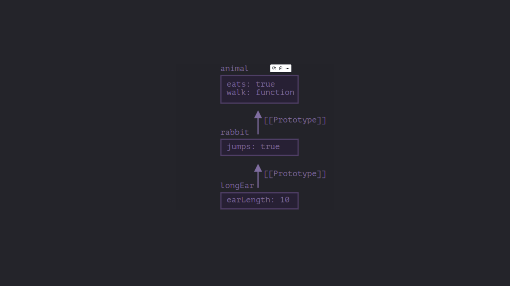

<a name="top"></a>

# Interview Questions

1. [What is event delegation, and how does it function in JavaScript?](#event-delegation-js)

2. [Can you provide an illustration of how ES6 has altered the approach to working with "this" in JavaScript?](#es6-and-this)

3. [Explain the concept of prototypal inheritance.](#prototypal-inheritance)

4. Differentiate between a variable that is null, undefined, or undeclared.

5. Define what a closure is and describe its uses and advantages.

6. Explain the primary distinction between the Array.forEach() loop and Array.map() method, as well as when to choose one over the other.(see polyfills also)

7. What is a common scenario for employing anonymous functions?

8. Distinguish between host objects and native objects.
   -Clarify the distinctions among 'function User(){}', 'var user = User()', and 'var user = new User()

9. Can you explain the purposes of Function.call and Function.apply, along with their notable differences?

10. Describe the Function.prototype.bind method.

11. Explain the differences between feature detection, feature inference, and utilizing the User Agent (UA) string.

12. Define the concept of "hoisting."

13. What is type coercion, and what are some common pitfalls associated with relying on it in JavaScript code?

14. Describe event bubbling and event capturing.

15. What distinguishes an "attribute" from a "property"?

16. List the advantages and disadvantages of extending built-in JavaScript objects.

17. Explain the differences between == and ===.

18. Discuss the same-origin policy's implications for JavaScript.

19. Why is it referred to as a "Ternary operator," and what does the term "Ternary" signify?

20. Define strict mode and outline some of its advantages and disadvantages.

21. Analyze the pros and cons of writing JavaScript code in a language that compiles to JavaScript.

22. What tools and techniques do you employ for debugging JavaScript code?

23. Enumerate the benefits and drawbacks of immutability and explain how you can achieve it in your code.

24. Differentiate between synchronous and asynchronous functions and elucidate the event loop.

25. Explain the disparities between variables created using let, var, or const.

26. Compare ES6 classes and ES5 function constructors, and furnish a use case for the arrow (=>) function syntax.

27. Describe the advantages of using the arrow syntax for methods in constructors.

28. Define a higher-order function and provide an example of object or array destructuring.

29. Give an example of generating a string using ES6 Template Literals and explain their benefits.

30. Provide an example of a curry function and clarify why this syntax can be advantageous.

31. Discuss the benefits of using spread syntax and differentiate it from rest syntax.

- Explain debounce vs throttling.
- Define what a promise is and describe its applications.
- Explore how Object-Oriented Programming (OOP) principles can be applied when coding in JavaScript.

# Answers/Solutions

**1. Event Delegation in JS**
</br>
<a name="event-delegation-js" style="text-decoration: none">
Event delegation is a technique in javascript where instead of handling individual events on child elements, you add a handler on the parent which handles events for all the child elements. This technique works on the concept of event bubbling where an event object gets created when an event occurs and travels down to the target object and then bubbles up. It is in the bubbling phase that the event is caught by the event listener attached to the parent.</br>
<b>It can prove to be optimal as it reduces the need of attaching a lot of event listeners which can make the application slow</b>

```html
<div id="parent">
  <button>child1</button><button>child2</button
  ><button>child3</button>
</div>
<script>
  const parent =
    document.getElementById("parent");
  parent.addEventListener("click", (e) => {
    alert(e.target.textContent);
  });
</script>
```

</a>

[Back to top ⬆️](#top)

**2. ES6 and the this keyword**
</br>
<a name="es6-and-this" style="text-decoration: none">
ES6 introduced several features that has affected how developers work with the this keyword in Javascript, particularly with the introduction of arrow functions and lexical scoping

<li><b>Arrow Functions</b></li>
</br>
Arrow functions don't get their own this keyword and inside these functions, the this keyword is lexically scoped, that is, it inherits the this value from the surrounding code.

```javascript
let obj = {
  name: "faheem",
  age: 25,

  func1() {
    console.log(this.name);

    const new_func = () => console.log(this.age);
    const new_func_1 = function () {
      console.log(this.age);
    };

    new_func();
    new_func_1();
  },

  func2: () => {
    console.log(this.age);
  },
};

obj.func1();
//faheem
//25
//undefined
obj.func2();
//undefined
```

**Explanation**
</br>
When func1 is called by the obj, the this inside the func1 points to the obj where as the new_func being an arrow function doesn't get it's own this keyword, gets it from the surrounding code where this===obj.
</br>
In case of new_func_1, it is a normal function and it is invoked normally and as such the this keyword inside the new_func_1 is undefined.
</br>
In case of func2, this inside func2 points to the global object and as such this.age is undefined.
</a>

[Back to top ⬆️](#top)

**3. Prototypal inheritance in JS**

<a name="prototypal-inheritance" style="text-decoration: none">
The general concept of inheritance is to extend a property or a method from a parent down to it's children.
Prototypal inheritance is the linking of prototypes of a parent object to share the properties 
and methods of a parent class with child classes.Prototypes are hidden objects that are used to share properties and 
methods from a parent class to it's child classes.

**[[Prototype]]**
In JavaScript, objects have a special hidden property `[[Prototype]]`, that is either null or references another object. That object is called **“a prototype”**.

When we read a property from an `object`, and it’s missing, JavaScript automatically takes it from the prototype. In programming, this is called **“prototypal inheritance”**.

The property `[[Prototype]]` is internal and hidden, but there are many ways to set it.

One of them is to use the special name `__proto__`. Few things to consider about `__proto__`:

- It is a getter/setter for the `[[Prototype]]` object but is deprecated.
- It can either be an object or null.
- We can't have circular referrences. Javascript will throw an error if we try to do so.

Javascript recommends to use `Object.getPrototypeOf/Object.setPrototypeOf` functions instead that get/set the prototype.



```javascript
let animal = {
  eats: true,
  walk() {
    alert("Animal walk");
  },
};

let rabbit = {
  jumps: true,
  __proto__: animal,
};

let longEar = {
  earLength: 10,
  __proto__: rabbit,
};

// walk is taken from the prototype chain
longEar.walk(); // Animal walk

alert(longEar.jumps); // true (from rabbit)
```

**Summary**

- In JavaScript, all objects have a hidden `[[Prototype]]` property that’s either another object or null.

- We can use obj.**proto** to access it (a historical getter/setter).

- The object referenced by `[[Prototype]]` is called a “prototype”.

- If we want to read a property of obj or call a method, and it doesn’t exist, then JavaScript tries to find it in the prototype.

- Write/delete operations act directly on the object, they don’t use the prototype (assuming it’s a data property, not a setter).

- If we call obj.method(), and the method is taken from the prototype, this still references obj. So methods always work with the current object even if they are inherited.

- The `for..in` loop iterates over both its own and its inherited properties. All other `key/value-getting methods` only operate on the object itself.
  </a>

[Back to top ⬆️](#top)
